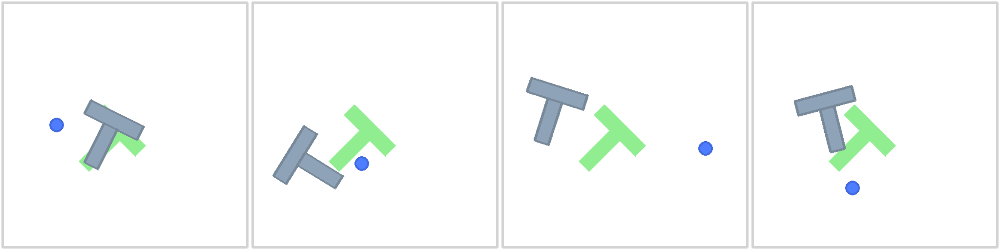
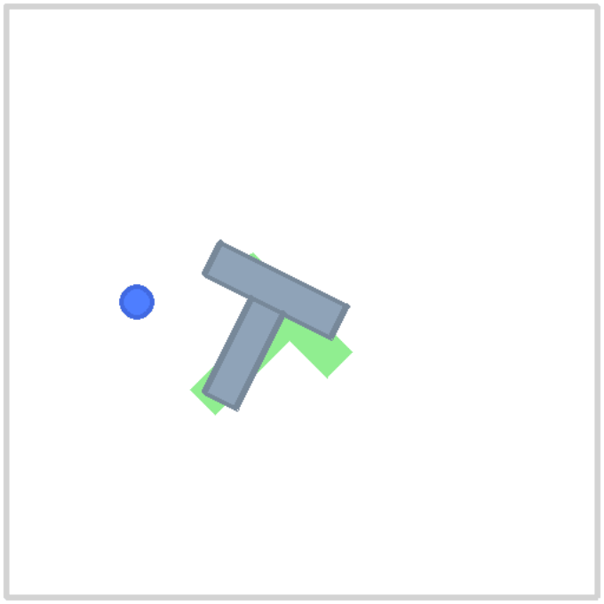
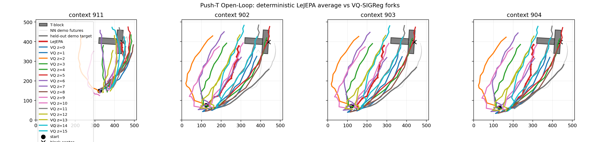
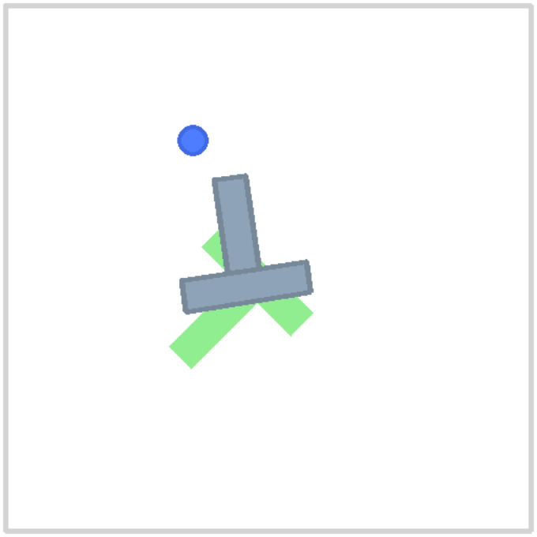
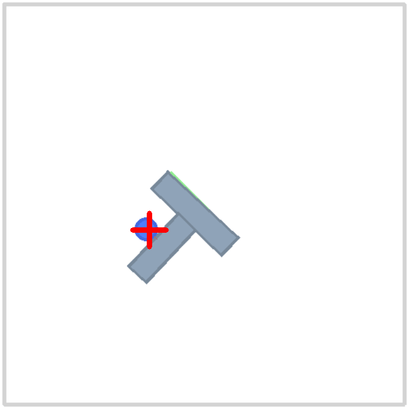

# VQ-SIGReg Push-T

This package contains the state-based Push-T VQ-SIGReg code used in the current
results. Observations are compact Push-T states:

```text
[agent_x, agent_y, block_x, block_y, cos(block_angle), sin(block_angle)]
```

The core idea is simple: SIGReg keeps representation geometry healthy, while a
small enumerated VQ latent gives one state multiple candidate futures. At
inference, the policy decodes `K=16` action chunks and selects a chunk with a
learned prior `P(z | state)`.

## Visuals

Qualitative assets are checked in under `assets/gallery/`. These are
rollout snippets and still frames, not score claims.

| VQ-SIGReg rollout grid | Recovery snippet |
| --- | --- |
|  |  |

| Diffusion rollout snippets | Open-loop candidate routes |
| --- | --- |
|  |  |

| Diffusion seed 10005 | Diffusion seed 10012 |
| --- | --- |
|  |  |

| VQ-SIGReg start | VQ-SIGReg mid | VQ-SIGReg end |
| --- | --- | --- |
|  |  |  |

## Current Results

Closed-loop evaluation uses `gym_pusht/PushT-v0`, state observations,
`max_steps=300`, and 50 seeds starting at `10000`.

| Run | H | Mean max coverage | Strict success (`coverage > 0.95`) | >0.9 | Stalled |
| --- | ---: | ---: | ---: | ---: | ---: |
| K16 prior anchor | 16 | 0.876 | 0.28 | 0.82 | 0.06 |
| Continuous residual | 12 | 0.851 | **0.48** | 0.78 | 0.06 |
| Continuous residual + one-shot recovery | 16 | **0.898** | 0.28 | **0.84** | 0.06 |

The prior anchor stores `411,792` parameters and measured about `0.28 ms` GPU /
`0.70 ms` CPU per action chunk. The residual checkpoint stores `596,657`
parameters; about `423k` are active at inference because the target encoder and
reranker head are training/ablation-only.

This is not a SOTA Push-T claim. The honest claim is: VQ-SIGReg is a small,
fast, multimodal state-based policy that substantially improves over a matched
deterministic LeJEPA/SIGReg baseline in this harness. The original Diffusion
Policy literature result remains an external quality target.

## Package Contents

Core runtime:

- `models.py` - LeJEPA and VQ-SIGReg modules, VQ codebook, prior head, residuals.
- `pusht_data.py` - Push-T zarr chunk loader and normalization.
- `pusht_env.py` - Push-T environment helpers, including exact state setting.
- `pusht_policy.py` - closed-loop policy wrappers and checkpoint loading.
- `pusht_rollout.py` - closed-loop state-based rollout logic.
- `diffusion_policy.py` - small in-repo Diffusion Policy baseline.
- `official_lejepa.py` - wrapper for upstream SIGReg from `external/lejepa`.

Reproduction helpers copied into this package:

- `configs/pusht_openloop.yaml`
- `configs/branch2d.yaml`
- `scripts/pusht_openloop.py`
- `scripts/render_pusht_gif.py`
- `scripts/train_continuous_residual.py`
- `scripts/train_dp.py`
- `scripts/branch2d_compare.py`
- `scripts/mine_pusht_ambiguous.py`
- `scripts/diagnostics/eval_dp_harness.py`
- `scripts/diagnostics/render_dp_rollout.py`
- `scripts/diagnostics/sanity_check_replay.py`
- `tests/test_core.py`

## External Inputs

To reproduce the real Push-T numbers, provide the official Diffusion Policy
Push-T zarr at:

```text
data/pusht/pusht_cchi_v7_replay.zarr
```

The SIGReg regularizer expects the upstream LeJEPA package available at
`external/lejepa`, as in this repository layout.

## Reproduce

Run package tests:

```bash
uv run pytest tests -q
```

Train the K16 prior anchor:

```bash
uv run python scripts/pusht_openloop.py \
  --config configs/pusht_openloop.yaml \
  --device cuda:1 \
  --codebook-size 16 \
  --out-dir outputs/vq_sigreg_pusht_k16_prior
```

Evaluate the prior anchor over the approved 50-seed range:

```bash
uv run python scripts/render_pusht_gif.py \
  --checkpoint outputs/vq_sigreg_pusht_k16_prior/vq_sigreg_latest.pt \
  --device cuda:1 \
  --episodes 50 \
  --start-seed 10000 \
  --replan-every 16 \
  --selector prior \
  --no-gif \
  --quiet \
  --json-out outputs/vq_sigreg_pusht_k16_prior/horizon_16_50seed_closed_loop.json
```

Train the continuous residual head from the prior checkpoint:

```bash
uv run python scripts/train_continuous_residual.py \
  --checkpoint outputs/vq_sigreg_pusht_k16_prior/vq_sigreg_latest.pt \
  --out-dir outputs/vq_sigreg_pusht_k16_continuous_residual_s003_g48_a035 \
  --device cuda:1 \
  --residual-scale 0.03 \
  --gate-scale-px 48 \
  --gate-angle-rad 0.35 \
  --residual-steps 2
```

Evaluate the residual checkpoint with one-shot recovery:

```bash
uv run python scripts/render_pusht_gif.py \
  --checkpoint outputs/vq_sigreg_pusht_k16_continuous_residual_s003_g48_a035/vq_continuous_residual_latest.pt \
  --device cuda:1 \
  --episodes 50 \
  --start-seed 10000 \
  --replan-every 16 \
  --selector recovery_prior \
  --recovery-push-px 200 \
  --recovery-max-uses 1 \
  --recovery-goal-progress-px -2 \
  --no-gif \
  --quiet \
  --json-out outputs/_approval/recovery_h16_50seed.json
```

Train the in-repo Diffusion Policy baseline on the same chunk dataset:

```bash
uv run python scripts/train_dp.py \
  --config configs/pusht_openloop.yaml \
  --out-dir outputs/vq_sigreg_pusht_dp \
  --steps 50000 \
  --device cuda:1
```

Evaluate that diffusion baseline:

```bash
uv run python scripts/diagnostics/eval_dp_harness.py \
  --checkpoint outputs/vq_sigreg_pusht_dp/dp_latest.pt \
  --device cuda:1 \
  --episodes 50 \
  --start-seed 10000 \
  --replan-every 16 \
  --harness warm \
  --rng-seeds 0 1 2 \
  --out outputs/_approval/dp_warm_50seed.json
```

## Harness Notes

Use `set_env_state_exact()` from `pusht_env.py` for replay or counterfactual
diagnostics. The stock private state setter in `gym_pusht` changes the T-block
pose when angle and position are restored in the wrong order.

Report these metrics separately:

- mean max coverage,
- strict success (`coverage > 0.95` / env `is_success`),
- fraction above `0.9`,
- stalled fraction below `0.1`,
- checkpoint, seed range, max steps, horizon, selector, and recovery flags.

The local zarr demonstrations replay with high max coverage but low strict
success under the env threshold, so do not collapse the metrics into one number.
